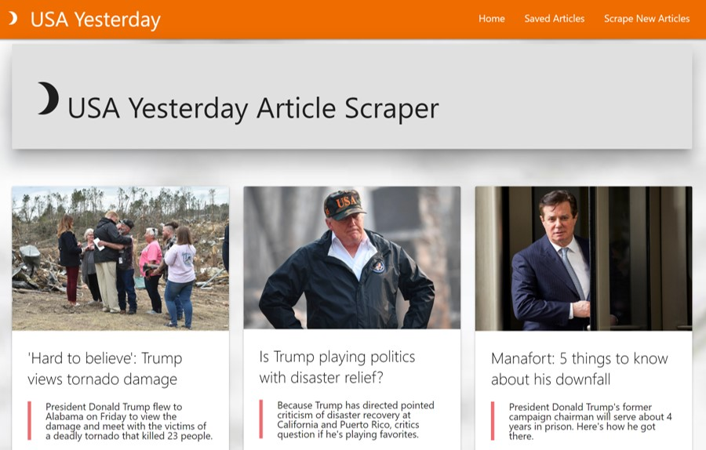

# USA Yesterday
Because yesterday all our troubles seemed so far away.

https://usa-yesterday.herokuapp.com/

David Ferro

## Description

USA Yesterday is an article scraper application that gathers articles from USA Today and saves the important information in a MongoDB database.  The data schematics were built using Mongoose, while the scraping was done via Axios and Cheerio.

The application is designed in the MVC model for Node.js and Express.js, using Express-Handlebars to create the views.  The UI was built using Materialize CSS framework and jQuery to make the pages responsive.  Materialize makes the application mobile friendly, so feel free to scrape articles from your phone.

Not only does the application find articles, it can also save your notes about each of the articles.  You also have the option to delete your notes if you don't think they are relevant anymore.  Feel free to read others' notes as well.

To find more articles, you can scrape more by using the link in the navigation bar.

If you have any questions, feel free to contact me at david-ferro@sbcglobal.net.

Enjoy!
